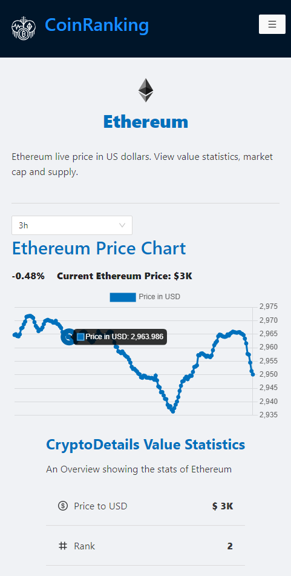
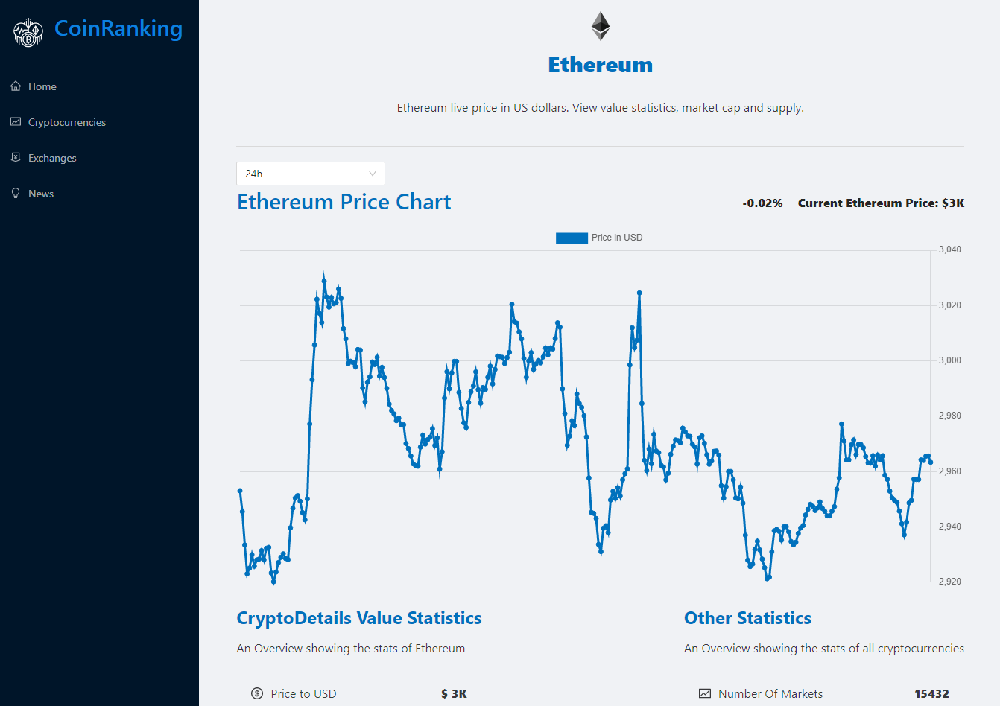

<h1 align="center">
    CoinRanking App
</h1>

## Reviews
<p align="center">
    
    
</p>

## Packages Installed
```bash
    +-- @ant-design/icons@4.7.0
    +-- antd@4.18.9
    +-- axios@0.26.0
    +-- html-react-parser@1.4.8
    +-- millify@4.0.0
    +-- moment@2.29.1
    +-- react-chartjs-2@3.0.4
    +-- react-dom@17.0.2
    +-- react-redux@7.2.6
    +-- react-router-dom@5.2.1
```

## In the project directory, you can run:
#### `npm start`

Runs the app in the development mode.

## App Running

[CryptoRanking](https://di4m0nds-cryptoranking.netlify.app/)